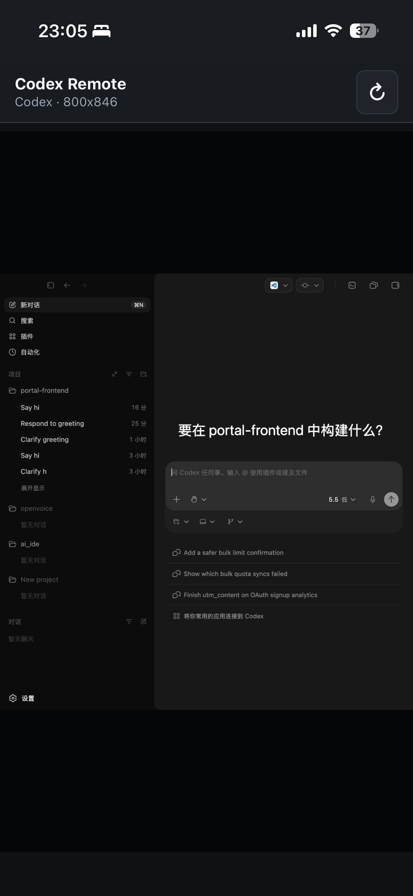

# codex-app-remotely

远程操作你电脑上的 Codex.app。这个项目会以受控方式启动本机 Codex Electron App，开启 Electron 的 Chrome DevTools Protocol，然后把画面和输入事件转发到移动端 Web 页面。手机和电脑在同一局域网时，可以直接用手机控制本机 Codex 应用。

## 截图



## 要求

- Node.js 22+
- macOS 上的 Codex Electron App
- 手机和电脑位于同一网络

## 安装和使用

无需安装即可运行：

```bash
npx codex-app-remotely
```

也可以全局安装 CLI：

```bash
npm install -g codex-app-remotely
```

安装后使用：

```bash
car
```

服务启动后会输出一个带 `token` 的局域网 URL，并在终端显示该链接的二维码，手机扫码或在浏览器打开链接即可。

默认从 `9222` 开始自动选择一个空闲 CDP 端口。如果 `9222` 已经被 Chrome 或其他程序占用，服务会自动切到下一个可用端口。

### 指定 Codex App 路径

如果 Codex app 不在默认位置，显式指定路径：

```bash
npx codex-app-remotely --app "/Applications/Codex.app"
```

全局安装后等价写法：

```bash
car --app "/Applications/Codex.app"
```

### 连接已启动的 Codex

如果你已经手动启动了 Codex 并开启 CDP：

```bash
npx codex-app-remotely --no-launch --cdp-port 9222
```

全局安装后等价写法：

```bash
car --no-launch --cdp-port 9222
```

手动启动 Electron CDP 的参数形式通常是：

```bash
"/Applications/Codex.app/Contents/MacOS/Codex" --remote-debugging-port=9222 --remote-allow-origins=*
```

## 常用配置

```bash
car \
  --host 0.0.0.0 \
  --port 3147 \
  --cdp-port 9333 \
  --screencast-every-nth-frame 1 \
  --screencast-max-fps 12 \
  --screenshot-max-width 1920 \
  --screenshot-max-height 1350 \
  --screenshot-quality 68
```

也可以使用环境变量：

- `CODEX_APP_PATH`
- `CODEX_EXECUTABLE`
- `CDP_HOST`
- `CDP_PORT`
- `HOST`
- `PORT`
- `REMOTE_TOKEN`
- `SCREENCAST_EVERY_NTH_FRAME`
- `SCREENCAST_MAX_FPS`
- `SCREENSHOT_MAX_WIDTH`
- `SCREENSHOT_MAX_HEIGHT`
- `SCREENSHOT_QUALITY`
- `NO_LAUNCH=1`

## 架构

- `src/server.js`：入口，编排启动器、CDP 桥和移动端 WebSocket。
- `src/codexLauncher.js`：定位并启动 Codex Electron App，注入 `--remote-debugging-port`。
- `src/cdpClient.js`：连接 CDP target，使用 `Page.startScreencast` 接收画面帧，并把点击、滚动、文字、按键转换为 CDP `Input` 命令。
- `src/mobileWsServer.js`：零依赖 WebSocket 服务端，负责移动端消息收发。
- `src/staticServer.js`：静态页面和少量状态 API。
- `public/`：移动端控制页面。

## 安全说明

CDP 拥有很高权限，本项目默认只让移动端连接本服务的 WebSocket，不直接暴露 CDP 端口。移动端连接需要启动时生成的一次性 `token`。建议只在可信局域网中使用，结束后关闭服务。由本服务自动启动的 Codex app 会在服务关闭时一同退出；使用 `--no-launch` 连接手动启动的 Codex 时，本服务不会关闭该外部进程。
